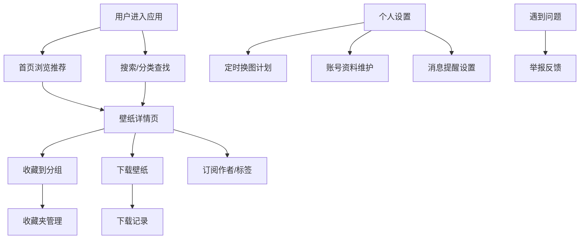

## 1. 产品概述

WallpaperHub 是一款面向喜欢频繁更换桌面壁纸用户的壁纸订阅管理 Web 应用。用户可以浏览、搜索、收藏、下载高质量壁纸，订阅图片来源，设置定时换图计划，并管理个人收藏和下载记录。

- 核心目标：为用户提供一站式壁纸发现、管理和自动更换体验
- 目标用户：桌面美化爱好者、设计师、需要经常更换桌面背景的创意工作者
- 市场价值：解决用户壁纸来源分散、管理困难、手动更换繁琐的痛点

## 2. 核心功能

### 2.1 用户角色
| 角色 | 注册方式 | 核心权限 |
|------|----------|----------|
| 普通用户 | 邮箱/用户名注册 | 浏览壁纸、收藏下载、设置换图计划、管理个人资料 |

### 2.2 功能模块
1. **首页推荐**：精选推荐轮播、热门排行、最新壁纸、编辑精选
2. **分类浏览**：按风格/主题/颜色/场景分类、子分类筛选
3. **搜索筛选**：关键词搜索、分辨率筛选、设备比例筛选、标签过滤、高级筛选
4. **壁纸详情**：大图预览、设备比例预览、暗色预览、相似壁纸推荐、版权说明、下载水印提示
5. **收藏夹**：收藏夹分组、批量收藏、批量管理、快速预览
6. **下载记录**：下载历史、历史记录清理、下载统计
7. **个人设置**：账号资料维护、定时换图计划、来源订阅、标签关注、消息提醒设置
8. **举报反馈**：失效链接反馈、内容举报、意见反馈、举报记录

### 2.3 页面详情
| 页面名称 | 模块名称 | 功能描述 |
|----------|----------|----------|
| 首页推荐 | 精选轮播 | 自动轮播展示精选壁纸，支持手动切换 |
| 首页推荐 | 热门排行榜 | 展示本周/本月下载量最高的壁纸 Top 10 |
| 首页推荐 | 最新壁纸 | 瀑布流展示最新上传的壁纸 |
| 首页推荐 | 编辑精选 | 展示编辑推荐的主题壁纸合集 |
| 分类浏览 | 分类导航 | 展示所有一级分类，支持点击进入子分类 |
| 分类浏览 | 壁纸网格 | 按分类展示壁纸，支持切换视图模式 |
| 分类浏览 | 侧边筛选 | 按分辨率、颜色、标签进行二次筛选 |
| 搜索筛选 | 搜索栏 | 关键词搜索，支持搜索历史和热门搜索 |
| 搜索筛选 | 筛选面板 | 分辨率筛选（4K/2K/1080P/自定义）、设备比例（16:9/21:9/9:16/4:3）、颜色筛选 |
| 搜索筛选 | 结果列表 | 展示搜索结果，支持排序和视图切换 |
| 壁纸详情 | 大图预览区 | 主预览图，支持缩放、拖动查看 |
| 壁纸详情 | 设备预览切换 | 桌面/平板/手机多设备比例预览 |
| 壁纸详情 | 暗色预览 | 切换暗色模式预览壁纸效果 |
| 壁纸详情 | 信息面板 | 标题、作者、分辨率、大小、上传时间、版权信息 |
| 壁纸详情 | 操作区 | 收藏、下载、分享、订阅作者 |
| 壁纸详情 | 相似推荐 | 基于标签/颜色/风格推荐相似壁纸 |
| 收藏夹 | 分组侧边栏 | 展示收藏夹分组，支持新建/编辑/删除分组 |
| 收藏夹 | 壁纸网格 | 展示当前分组的收藏壁纸 |
| 收藏夹 | 批量操作 | 批量选择、移动、删除、导出 |
| 下载记录 | 时间线列表 | 按时间倒序展示下载记录 |
| 下载记录 | 统计面板 | 展示下载总量、本月下载、收藏数量等统计 |
| 下载记录 | 清理功能 | 按时间范围清理历史记录 |
| 个人设置 | 账号资料 | 头像、昵称、邮箱、密码修改 |
| 个人设置 | 换图计划 | 设置定时更换壁纸的时间间隔和壁纸来源 |
| 个人设置 | 来源订阅 | 管理已订阅的壁纸来源和作者 |
| 个人设置 | 标签关注 | 关注感兴趣的标签，获取相关推荐 |
| 个人设置 | 消息提醒 | 开关各类消息通知（更新提醒、收藏提醒等） |
| 举报反馈 | 举报表单 | 选择举报类型、填写原因、上传截图 |
| 举报反馈 | 失效链接 | 一键反馈壁纸链接失效 |
| 举报反馈 | 举报记录 | 查看历史举报记录和处理状态 |

## 3. 核心流程

用户进入首页后，浏览推荐壁纸或通过搜索/分类找到感兴趣的壁纸，点击进入详情页预览，可收藏到指定分组或直接下载。用户可在个人设置中配置定时换图计划，系统按计划自动更换壁纸。如遇问题可通过举报反馈页面提交问题。

## 4. 用户界面设计

### 4.1 设计风格
- **主色调**：深海蓝 `#0f172a`，搭配霓虹青 `#22d3ee` 作为点缀色
- **辅助色**：深紫灰 `#1e1b4b`，渐变用于营造沉浸感
- **背景**：深色主题为主，采用渐变网格+噪点纹理营造高级感
- **按钮风格**：圆角胶囊型按钮，悬停时有发光效果
- **字体**：标题使用 'Space Grotesk'，正文使用 'Inter'
- **布局风格**：卡片式瀑布流布局，侧边导航栏
- **图标风格**：使用 lucide-react 线性图标

### 4.2 页面设计概述
| 页面名称 | 模块名称 | UI 元素 |
|----------|----------|---------|
| 首页推荐 | 精选轮播 | 全屏大图轮播，渐变遮罩标题，指示器动画 |
| 首页推荐 | 热门排行 | 数字排名徽章，缩略图+标题+下载量 |
| 首页推荐 | 壁纸网格 | 响应式瀑布流卡片，悬停浮层显示操作按钮 |
| 分类浏览 | 分类卡片 | 渐变色背景分类卡片，悬停放大效果 |
| 搜索筛选 | 筛选面板 | 可折叠侧边栏，多选项标签组，滑块控件 |
| 壁纸详情 | 预览区 | 主图居中展示，左右切换按钮，设备预览切换器 |
| 壁纸详情 | 操作浮层 | 底部悬浮操作栏，毛玻璃背景效果 |
| 收藏夹 | 分组列表 | 可拖拽排序分组，徽章显示数量 |
| 个人设置 | 设置面板 | 标签页切换，分组表单，开关控件 |

### 4.3 响应式
- 桌面端优先设计，适配 1440px / 1920px 宽度
- 平板端：侧边栏折叠为图标模式，网格列数减少
- 移动端：底部导航栏，单列瀑布流，触摸优化操作

### 4.4 动画与交互
- 页面切换：淡入淡出过渡，元素错位入场
- 卡片悬停：轻微上浮 + 阴影加深 + 边框发光
- 图片加载：模糊占位图渐变清晰
- 收藏/下载：图标弹跳动画，成功提示 Toast
