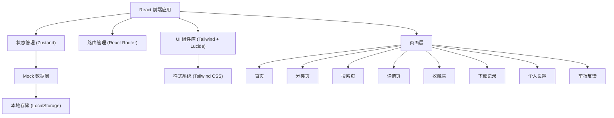
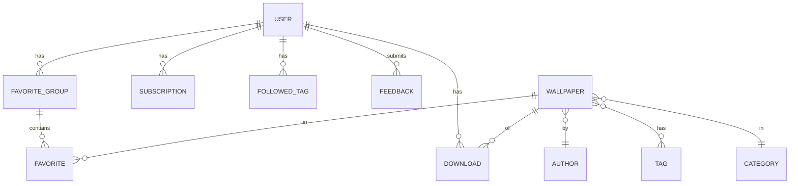

## 1. 架构设计



## 2. 技术描述

- **前端框架**: React@18 + TypeScript
- **构建工具**: Vite@5
- **路由**: react-router-dom@6
- **状态管理**: zustand@4
- **样式方案**: Tailwind CSS@3
- **图标库**: lucide-react
- **后端**: 无后端，前端 Mock 数据 + LocalStorage 持久化
- **数据存储**: LocalStorage（收藏、下载记录、用户设置）

## 3. 路由定义

| 路由 | 页面 | 说明 |
|------|------|------|
| `/` | Home | 首页推荐 |
| `/categories` | Categories | 分类浏览 |
| `/categories/:id` | CategoryDetail | 分类详情 |
| `/search` | Search | 搜索筛选 |
| `/wallpaper/:id` | WallpaperDetail | 壁纸详情 |
| `/favorites` | Favorites | 收藏夹 |
| `/downloads` | Downloads | 下载记录 |
| `/settings` | Settings | 个人设置 |
| `/settings/profile` | Settings | 账号资料 |
| `/settings/schedule` | Settings | 换图计划 |
| `/settings/subscriptions` | Settings | 来源订阅 |
| `/settings/tags` | Settings | 标签关注 |
| `/settings/notifications` | Settings | 消息提醒 |
| `/feedback` | Feedback | 举报反馈 |

## 4. 数据模型

### 4.1 数据模型定义



### 4.2 TypeScript 类型定义

```typescript
// 壁纸
interface Wallpaper {
  id: string;
  title: string;
  description: string;
  imageUrl: string;
  thumbnailUrl: string;
  resolutions: Resolution[];
  aspectRatio: '16:9' | '21:9' | '9:16' | '4:3' | '1:1';
  colors: string[];
  tags: string[];
  categoryId: string;
  authorId: string;
  views: number;
  downloads: number;
  favorites: number;
  uploadedAt: string;
  copyright: Copyright;
}

// 分辨率
interface Resolution {
  name: string;
  width: number;
  height: number;
  url: string;
  size: string;
}

// 版权信息
interface Copyright {
  type: 'free' | 'cc' | 'commercial';
  license: string;
  attribution?: string;
  watermark: boolean;
}

// 作者
interface Author {
  id: string;
  name: string;
  avatarUrl: string;
  bio: string;
  wallpaperCount: number;
  followerCount: number;
}

// 分类
interface Category {
  id: string;
  name: string;
  icon: string;
  color: string;
  parentId?: string;
  wallpaperCount: number;
}

// 标签
interface Tag {
  id: string;
  name: string;
  wallpaperCount: number;
}

// 收藏夹分组
interface FavoriteGroup {
  id: string;
  name: string;
  description?: string;
  coverUrl?: string;
  createdAt: string;
}

// 收藏项
interface Favorite {
  id: string;
  wallpaperId: string;
  groupId: string;
  addedAt: string;
}

// 下载记录
interface Download {
  id: string;
  wallpaperId: string;
  resolution: string;
  downloadedAt: string;
  filePath?: string;
}

// 订阅
interface Subscription {
  id: string;
  authorId: string;
  subscribedAt: string;
}

// 关注标签
interface FollowedTag {
  id: string;
  tagId: string;
  tagName: string;
  followedAt: string;
}

// 举报反馈
interface Feedback {
  id: string;
  type: 'broken_link' | 'inappropriate' | 'copyright' | 'suggestion';
  wallpaperId?: string;
  title: string;
  description: string;
  status: 'pending' | 'processing' | 'resolved' | 'rejected';
  createdAt: string;
}

// 换图计划
interface Schedule {
  enabled: boolean;
  interval: 'hourly' | 'daily' | 'weekly' | 'custom';
  customHours?: number;
  sourceType: 'favorites' | 'subscription' | 'tag' | 'all';
  sourceId?: string;
  lastChanged?: string;
}

// 用户设置
interface UserSettings {
  darkPreview: boolean;
  autoDownload: boolean;
  defaultResolution: string;
  notifications: {
    subscriptionUpdate: boolean;
    favoriteReminder: boolean;
    weeklyDigest: boolean;
    systemNotice: boolean;
  };
}

// 用户
interface User {
  id: string;
  username: string;
  email: string;
  avatarUrl?: string;
  bio?: string;
  createdAt: string;
  schedule: Schedule;
  settings: UserSettings;
}
```

## 5. 项目结构

```
src/
├── components/          # 可复用组件
│   ├── layout/         # 布局组件
│   │   ├── Sidebar.tsx
│   │   ├── Header.tsx
│   │   └── Layout.tsx
│   ├── wallpaper/      # 壁纸相关组件
│   │   ├── WallpaperCard.tsx
│   │   ├── WallpaperGrid.tsx
│   │   ├── WallpaperPreview.tsx
│   │   └── DevicePreview.tsx
│   ├── common/         # 通用组件
│   │   ├── Button.tsx
│   │   ├── Modal.tsx
│   │   ├── Toast.tsx
│   │   ├── Tag.tsx
│   │   └── Empty.tsx
│   └── filter/         # 筛选相关组件
│       ├── FilterPanel.tsx
│       ├── ResolutionFilter.tsx
│       └── ColorFilter.tsx
├── pages/              # 页面组件
│   ├── Home.tsx
│   ├── Categories.tsx
│   ├── Search.tsx
│   ├── WallpaperDetail.tsx
│   ├── Favorites.tsx
│   ├── Downloads.tsx
│   ├── Settings.tsx
│   └── Feedback.tsx
├── store/              # Zustand 状态管理
│   ├── useWallpaperStore.ts
│   ├── useUserStore.ts
│   ├── useFavoriteStore.ts
│   └── useUISTore.ts
├── data/               # Mock 数据
│   ├── wallpapers.ts
│   ├── categories.ts
│   ├── authors.ts
│   └── tags.ts
├── types/              # TypeScript 类型
│   └── index.ts
├── utils/              # 工具函数
│   ├── storage.ts
│   ├── format.ts
│   └── image.ts
├── hooks/              # 自定义 Hooks
│   ├── useDebounce.ts
│   ├── useLocalStorage.ts
│   └── useToast.ts
├── App.tsx
├── main.tsx
└── index.css
```

## 6. 状态管理设计

### 6.1 壁纸状态 (useWallpaperStore)
- `wallpapers`: 所有壁纸列表
- `featuredWallpapers`: 精选推荐
- `hotWallpapers`: 热门排行
- `newWallpapers`: 最新壁纸
- `currentWallpaper`: 当前查看壁纸
- `searchResults`: 搜索结果
- `filters`: 当前筛选条件
- 方法：`getWallpaperById`, `searchWallpapers`, `filterWallpapers`, `getSimilarWallpapers`

### 6.2 用户状态 (useUserStore)
- `user`: 当前用户信息
- `isLoggedIn`: 登录状态
- 方法：`updateProfile`, `updateSettings`, `updateSchedule`

### 6.3 收藏状态 (useFavoriteStore)
- `groups`: 收藏夹分组
- `favorites`: 收藏项
- `downloads`: 下载记录
- `subscriptions`: 订阅列表
- `followedTags`: 关注标签
- `feedback`: 举报记录
- 方法：`createGroup`, `deleteGroup`, `addToFavorites`, `removeFromFavorites`, `batchMove`, `addDownload`, `clearDownloads`, `subscribe`, `unsubscribe`, `followTag`, `unfollowTag`, `submitFeedback`

### 6.4 UI 状态 (useUISTore)
- `sidebarCollapsed`: 侧边栏折叠
- `currentTheme`: 当前主题
- `toasts`: Toast 消息
- 方法：`toggleSidebar`, `showToast`, `hideToast`
